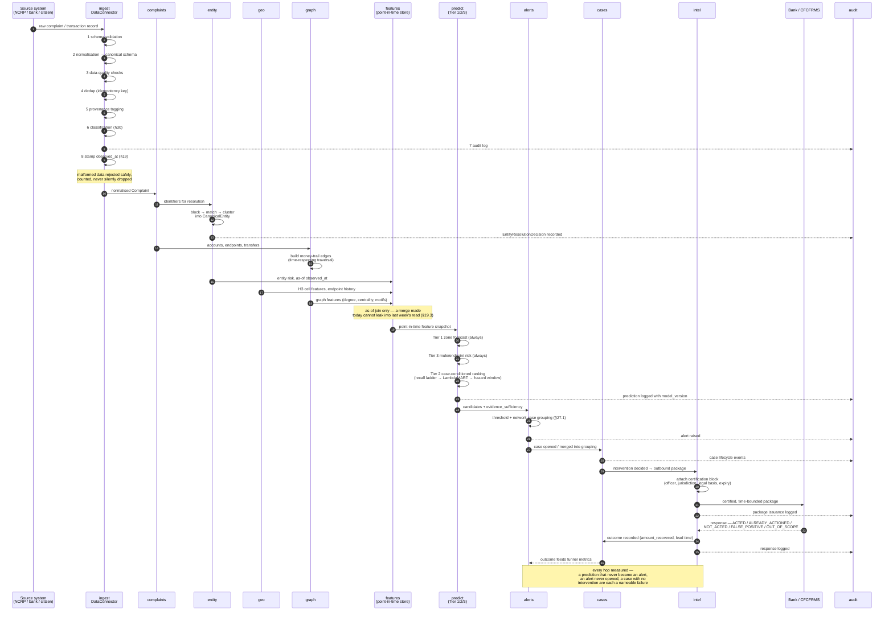
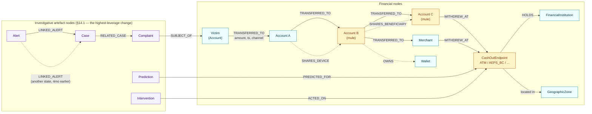

# Data Flow & Transaction Graph Model

Closes part of issue #9. Two diagrams: the **end-to-end data flow** from ingestion to
outcome (master spec §10–§28), and the **transaction graph model** used for money-trail
reconstruction and link analysis (§12, §14).

---

## 1. End-to-end data flow

This is the `Prediction → Alert → Case → Intelligence Package → Outcome` funnel (§1.1
of the reference-systems study, landed in spec §21.3/§25.1 as `ML-FUNNEL-001`), shown
as a sequence across the ingestion pipeline, the three prediction tiers, and the
bidirectional outbound-intelligence protocol (ADR-014).

**Why `observed_at` gates every read into `features`**: this is the mechanism behind
leakage gate 1. A feature pipeline that joined on `created_at` (when a row happened to
be written) instead of `observed_at` (when the fact became knowable) would let a model
see the future during training — a bug that produces artificially high offline
accuracy and then fails in production, silently, because nothing about the code looks
wrong.

**Why the funnel is drawn as one continuous flow**: §1.1 of the reference-systems
study (`docs/architecture/reference-systems-and-design.md`) makes conversion at every
hop — not model accuracy alone — the primary measured quantity. A prediction that never
becomes an alert, an alert never opened, and a case that produces no intervention are
three distinct, individually nameable failures, and this diagram is what "measured at
every hop" refers to concretely.

---

## 2. Transaction graph model

The money-trail graph (§12, §14). Built on recursive CTEs over PostgreSQL rather than
a separate graph database (ADR-002) — trails are 3–8 hops and bounded, so a second,
transactionally-inconsistent datastore is not worth the operational cost at this scale.

**Edge semantics that are load-bearing, not decorative:**

- **Edges are time-respecting.** A path may only be traversed forward in time —
  `A1 → A2` at 10:02 cannot connect to an `A2 → A3` edge at 09:58. The shortest
  *time-respecting* path is a different (and correct) question from the graph-theoretic
  shortest path.
- **Every edge carries amount · timestamp · type · source · destination · channel ·
  confidence · provenance.** An edge with no provenance cannot appear in an outbound
  intelligence package (ADR-014) or an evidence tab (§25).
- **Artefact nodes (`Complaint`, `Case`, `Alert`, `Prediction`, `Intervention`) are
  authorization-scoped like every other node** (§29). Traversing from your own
  complaint to a linked case in another jurisdiction returns the *existence* and *type*
  of the link — never that case's contents, which require separate authorization.
- **Artefact edges never feed prediction features.** A `Prediction` node linked to a
  `Case` is investigative context for a human. Letting it into the feature pipeline
  would let a model traverse to its own prior output and manufacture confidence from
  self-agreement — this is leakage gate 5, discovered specifically because artefact
  nodes were added (§8, "two leakage gates we did not expect").
- **No single edge or motif labels behaviour as criminal.** Structuring, fan-in/fan-out
  and rapid movement are also how legitimate businesses move cash; every suspicion
  surfaced to an investigator is a weighted combination with a stated contribution, not
  a single triggered rule.
