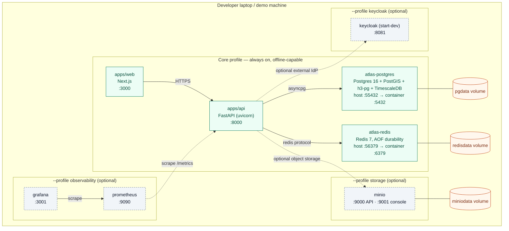

# Deployment

Closes part of issue #9 and the diagram requirement in master spec §44. Reflects the
actual `docker-compose.yml` at the repository root, and the three-environment boundary
defined in §5.

---

## 1. Local / demo deployment (environment A — this repository)

The **core profile must start offline on a laptop** via `docker compose up` (§7.1,
§7.2) — everything else lives behind an optional Compose profile, and the demo never
depends on one.

**Health-gated startup**: `postgres` and `redis` both carry `healthcheck` entries
(`pg_isready`, `redis-cli ping`) with retry budgets, so the API does not attempt to
serve traffic against a database that has not finished initialising — this is a
correctness property of the compose file, not just an operational nicety.

**Why Redis has `--appendonly yes`**: Redis Streams is the event bus (ADR-003), so an
in-memory-only Redis would silently drop queued events on a restart. `appendfsync
everysec` trades a bounded (≤1s) durability window for throughput headroom well above
the ~0.1 events/sec mean load this system is sized for.

---

## 2. Three-environment boundary (§5)

The public repository is environment A only. This diagram is the security control
described in §5 made visual: what is safe to publish, and what production swaps behind
the same ports without ever entering this repository.

```mermaid
flowchart LR
    subgraph A["A — Public repo / hackathon (this repository)"]
        A1["Synthetic data only"]
        A2["Built-in identity provider"]
        A3[".env.example only — no real secrets"]
        A4["Synthetic connector implementations"]
        A5["Mock notification provider"]
    end

    subgraph B["B — Controlled staging"]
        B1["Realistic synthetic data"]
        B2["Staging IdP"]
        B3["Vault / KMS"]
        B4["Mock connectors + contract tests"]
        B5["Sandbox notification gateways"]
    end

    subgraph C["C — Government production"]
        C1["Authorised real sources"]
        C2["Government IdP (NIC SSO / departmental)"]
        C3["Government-controlled HSM/KMS"]
        C4["Approved connectors under legal authority"]
        C5["Government notification gateway"]
    end

    A -->|"same code,<br/>swapped adapters<br/>behind documented ports (§7.3)"| B
    B -->|"same code,<br/>swapped adapters"| C

    classDef pub fill:#fef2f2,stroke:#b91c1c,color:#7f1d1d;
    classDef stage fill:#fef9c3,stroke:#a16207,color:#713f12;
    classDef prod fill:#dcfce7,stroke:#15803d,color:#14532d;

    class A1,A2,A3,A4,A5 pub;
    class B1,B2,B3,B4,B5 stage;
    class C1,C2,C3,C4,C5 prod;
```

**What makes the boundary a control and not a convention**: `.gitignore`,
`.env.example`, pre-commit hooks, and `gitleaks` run in CI against **full git history**
— not just the current diff — so a secret committed and later removed is still caught.
`PUBLIC_REPOSITORY_SECURITY_BOUNDARY.md` at the repository root states explicitly what
must never appear here: real financial data, real citizen PII, bank or government
credentials, production API keys, real account numbers, real transaction histories,
and real law-enforcement intelligence.

**Why the promotion path (A → B → C) matters for this diagram**: every port —
`DataConnector`, `IdentityProvider`, `NotificationProvider`, `SecretProvider`,
`ObjectStore`, `EventBus` (§7.3) — is defined once, in environment A, against a
synthetic or built-in adapter. Moving to B or C swaps the adapter behind that same
interface; it never requires changing the modules that consume it. This is what makes
the modular-monolith module boundaries (ADR-009) a deployment property, not just a code
organisation one.
