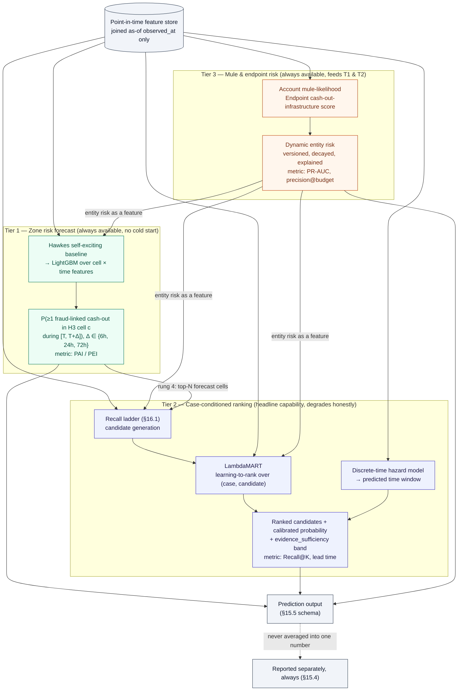
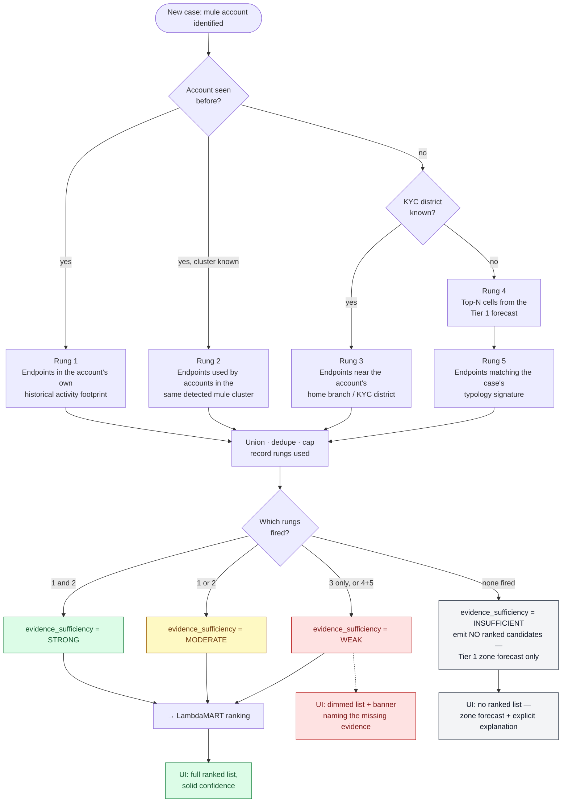

# ML Pipeline — Three Tiers and the Recall Ladder

Closes part of issue #9. Covers the predictive analytics engine (master spec §15),
candidate generation and cold start (§16), and the leakage boundary that makes the
whole pipeline trustworthy (§19). See ADR-004 for why three tiers exist instead of one
model, and ADR-012 for candidate generation.

---

## 1. Three-tier pipeline

**Why three tiers and not one model** (ADR-004): a single case-conditioned ranker
cold-starts to nothing for the common case — most complaints name a mule account the
system has never seen — and it cannot power the heatmap before any live case exists.
Tier 1 has no cold start and answers the problem statement's "predict potential
withdrawal hotspots" directly; Tier 3 is the shared substrate both other tiers consume
as features; Tier 2 is the headline capability and is the only one allowed to say "I
don't have enough evidence" via `evidence_sufficiency`.

**Why the tiers are never blended into one number** (§15.4): Tier 1 always works,
Tier 2 works when evidence supports it and says so when it doesn't, Tier 3 is a
multiplier on the other two. A single blended accuracy figure would hide exactly the
distinction — *is this a ranking failure or a cold-start situation?* — that determines
what an investigator should trust.

---

## 2. Recall ladder (Tier 2 candidate generation, §16)

The recall ladder is what prevents an undisclosed candidate set — the most common
silent failure mode in ranking systems. Rungs are unioned, deduplicated, capped, and
**which rungs contributed is recorded** (`recall_stage_rungs_used`) as part of the
prediction contract, not as debug output.

**Why cold start degrades confidence rather than hiding it** (§16.2): an unseen
account empties rungs 1 and 2, which is the common case, not the exception. The ladder
falls back to KYC-district proximity and typology signature — real signal, but weaker
— and `evidence_sufficiency` is downgraded accordingly. A `WEAK` prediction is required
to render visibly differently from a `STRONG` one; this is enforced by a UI test
because the failure it prevents — an investigator acting on a guess that looked like
evidence — is the one with real-world consequences (§25.4).

**Why negative sampling matters here** (§16.3): hard negatives are drawn from the same
recall set, stratified by distance band, so LambdaMART learns to discriminate between
*plausible* alternatives rather than between the true answer and random noise. A test
asserts the true endpoint is not preferentially placed in the candidate set relative to
negatives, and that recall-set construction never consults ground truth — otherwise a
Recall@K figure would be measuring the recall stage's own leakage, not the ranker.
