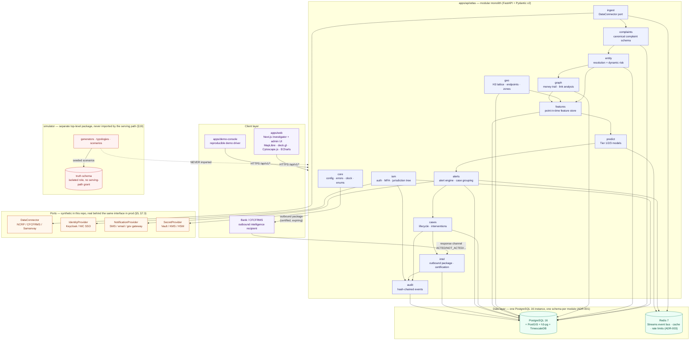
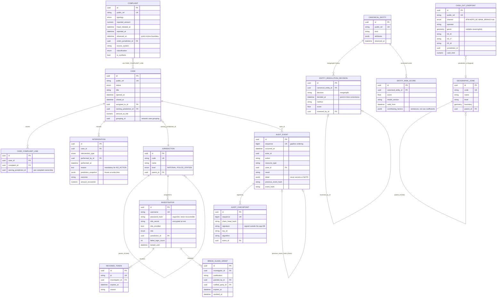

# System Architecture

Closes part of issue #9 (`docs: architecture diagrams (Mermaid)`) and the diagram
requirement in master spec §44. Two diagrams: the **system architecture** (container
view of the modular monolith, ADR-009) and the **entity-relationship diagram** for the
core domain model (master spec §8, §13, §26, §32).

Scope note: this describes environment **A — public repo / hackathon** (master spec
§5). Identity, secrets and connectors are the synthetic/built-in variants; production
swaps them behind the same ports without changing this picture.

---

## 1. System architecture (container view)

ATLAS is a **modular monolith** (ADR-009): one deployable API, one PostgreSQL
instance, hard module boundaries enforced in CI by `import-linter`. This diagram shows
the modules inside `apps/api/atlas`, the one-schema-per-module rule, and the ports at
the edge that keep production connectors out of the public repository.

**Why a modular monolith and not microservices** (ADR-009): one deployable, one
transactionally-consistent store, module boundaries enforced by `import-linter` in CI
rather than by network hops. Any module can be lifted into its own service later
because the seam — a service interface, never a raw schema read — already exists and
is tested.

**Why the simulator is drawn outside the serving path**: `simulator/` is a separate
top-level Python package. Nothing under `apps/api/atlas` may import it. Its `truth`
schema carries no grant for any application role — this is leakage gate 2 (§19) and is
verified by a CI import-isolation test, not by convention.

---

## 2. Entity-relationship diagram

Drawn from the actual SQLAlchemy models in `apps/api/atlas/*/models.py`. One schema
per module (ADR-001, ADR-009); cross-schema reads go through the owning module's
service interface, never a direct join across schemas in application code — the lines
below show the *data* relationships, not permitted query paths.

**Notes that matter more than the boxes:**

- **`observed_at` vs `created_at`** (`ObservationBase` / `Observed` mixin): every
  observation-carrying table has both. `created_at` is when ATLAS wrote the row;
  `observed_at` is when the fact became knowable. Feature reads join as-of
  `observed_at`, never `created_at` — this is leakage gate 1 (§19.1).
- **`CanonicalEntity` is not a foreign key target from `Complaint`/`Case` directly in
  this phase** — Phase 1 (this migration) ships identity, audit and the entity/geo
  reference tables; the complaint↔entity and case↔entity linking tables land in Phase 4
  (entity resolution + money trail, §47) and are intentionally absent here so the
  diagram matches what exists, not what is planned.
- **`AuditEvent.previous_event_hash`** is a logical chain reference (hash, not a
  SQLAlchemy FK) by design — the chain must survive even if the referenced row were
  ever inaccessible, which is the opposite property a normal FK gives you.
- **Real account numbers are never a primary key**, anywhere — `public_ref` fields are
  synthetic, mutable business references; `id` is always an internal UUID (§5, §8).
