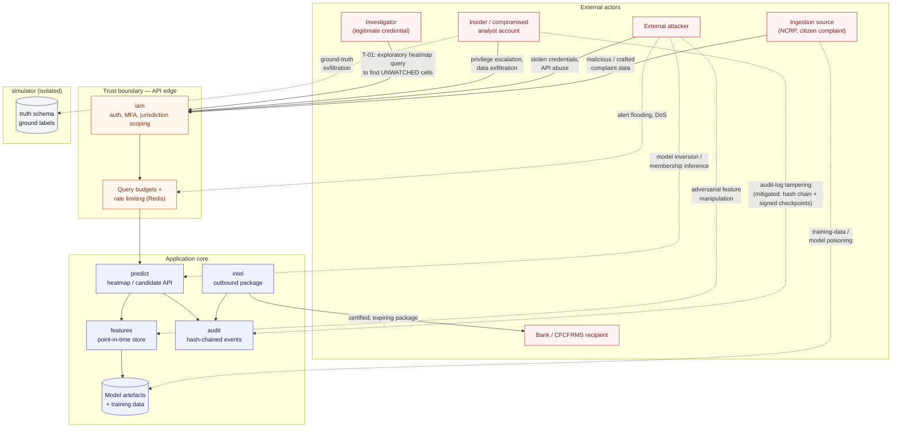
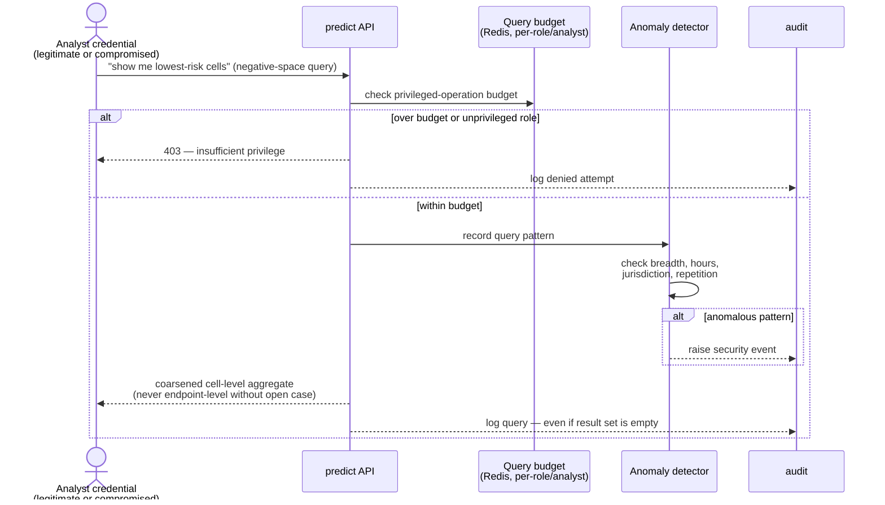

# Threat Model

Closes part of issue #9 and the file promised by master spec §35 ("Full model in
`docs/security/threat-model.md`"). STRIDE-organised, with the system-specific threat
(§35.1) called out separately because it is the one the predecessor's threat list
missed entirely, and the one that matters most here.

---

## 1. Attack-surface diagram

---

## 2. T-01 — the threat specific to this system

**Prediction-API abuse to locate unwatched endpoints.** A corrupt insider, or an
attacker holding a compromised analyst account, queries the heatmap not to find where
enforcement will be, but to find where it will **not** be — the cold cells — and cashes
out there. The system inverts into a crime-enabling tool while functioning exactly as
designed. This does not appear in the predecessor's seventeen listed threats, and it is
the one that matters most here, because the harm is caused by *correct operation*, not
a bug.

| | |
|---|---|
| **Attack surface** | `predict` heatmap / candidate-ranking API |
| **Impact** | Enables cash-out at locations enforcement is not watching; undermines the system's own purpose |
| **Likelihood** | Medium — requires a valid or compromised analyst credential, not a technical exploit |
| **Mitigation** | Query budgets per role/analyst (hard caps, server-enforced) · coarsened responses by role (cell-level aggregates unless an open case with jurisdictional nexus) · negative-space queries ("lowest-risk cells") treated as a privileged operation, not a filter toggle · per-analyst query-pattern anomaly detection (unusual breadth, off-hours sweeps, repeated low-risk sweeps, out-of-jurisdiction queries) · full audit of every prediction query, **including ones that returned nothing** |
| **Residual risk** | A sufficiently patient, low-and-slow query pattern from a credential with legitimate broad access could still evade anomaly detection; mitigated but not eliminated by jurisdiction-scoped coarsening |

---

## 3. STRIDE — the rest (§35.2)

| STRIDE category | Threats in scope | Primary mitigations |
|---|---|---|
| **Spoofing** | Stolen investigator credentials · compromised service account | MFA (ADR-006) · argon2id password hashing · short-lived tokens with revocation list (`RevokedToken`) · service-account credential rotation |
| **Tampering** | Audit-log tampering · adversarial manipulation of features · malicious data ingestion | Hash-chained audit events + externally-signed checkpoints (ADR-007) · append-only grant enforcement (no UPDATE/DELETE for any application role, asserted by migration test) · schema validation and DQ gates at ingestion (§10.2) |
| **Repudiation** | An investigator or bank denying an action was taken | Every case/alert/prediction action logged with actor, role, jurisdiction, correlation ID (§32) · `Intervention.performed_by_id` and `prediction_snapshot` frozen at write time so later model changes cannot retroactively alter the record |
| **Information disclosure** | Unauthorised data access · data exfiltration · model inversion / membership inference on the prediction API · ground-truth exfiltration from the simulator | Jurisdiction-scoped authorization (§29) · artefact-node traversal returns existence/type only, not contents, across jurisdiction boundaries (§14.1) · `truth` schema isolated with no serving-path grant (leakage gate 2, §19) · query budgets and coarsened responses (T-01) |
| **Denial of service** | Alert flooding · denial of service against the API or event bus | Rate limiting via Redis · alert consolidation / network case grouping reduces alert volume at the source (§27.1) · Redis Streams consumer groups sized with 5× headroom (§37, §38) |
| **Elevation of privilege** | Privilege escalation · insider misuse · supply-chain / dependency compromise | Least-privilege roles (§29, `Role` enum) · time-boxed, justified, audited break-glass access (`BreakGlassGrant`) — never unlogged emergency access · `gitleaks` + dependency scanning in CI (§42) · `import-linter`-enforced module boundaries limit blast radius of a compromised module |

**Model-specific threats**, not covered by classic STRIDE alone:

- **Training-data / model poisoning via crafted complaints.** A narrative field is
  attacker-controlled text and is isolated before it reaches any model (§11, §34); an
  LLM is never the authoritative source of a financial fact.
- **Response-channel poisoning** (ADR-014). A compromised bank recipient could
  systematically mislabel `ACTED`/`NOT_ACTED` responses to bias the model that learns
  from outcome data. Mitigated by per-recipient authentication, rate limiting,
  reliability weighting, and distribution-shift monitoring.
- **Point-in-time entity resolution leakage** and **artefact-edge leakage** (§19.3,
  §19.4) — not attacker-driven, but structural leakage vectors discovered while
  designing the entity and graph subsystems. Recorded here because a threat model that
  only lists adversarial threats misses the failure mode that is easiest to introduce
  by accident: a model quietly reading data it should not yet be able to see.

**Full mitigation detail for each item above lives in its owning spec section** (§29
security architecture, §30 data protection, §31 zero trust, §32 audit and evidence
integrity, §19 leakage control) — this document is the map from threat to mitigation to
owning section, not a duplicate of the control descriptions themselves.
